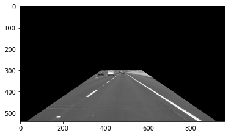
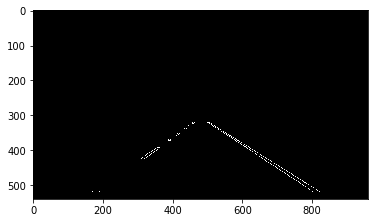
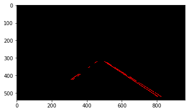
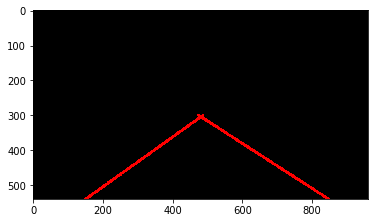
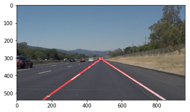

# Finding Lane Lines on the Road

This project aims at finding lane lines on the road images using computer vision techniques like edge detection and hough lines.

---

#### Pipeline

My video processing pipeline has following steps:

1. Read the color image


2. Convert the image to gray scale

3. Define a mask indicating region of interest (ROI) in the image, where we usually find the lane lines. 



4. Smooth the image using gaussian filter

5. Use the smoothened image to detect the edges. This is done by Canny Edge detection algorithm in opencv: `cv2.Canny()` with thresholds: `(50,150)`



6. Using, edge detected image, I get rid of the edges due to masking by defining another ROI. With remaining edges, I use probabilistic hough transform to estimate the line segments using `cv2.HoughLinesP()` function.



7. Using line segments, I define a threshold to seperate them into left and right lane lines

```python
    left_lines=list(filter(lambda x: (x[3]<x[1] and x[0]<480) ,lines.reshape((-1,4)).tolist()))
    right_lines=list(filter(lambda x: (x[3]>=x[1] and x[0]>480) ,lines.reshape((-1,4)).tolist()))
```

8. Then using `sklearn.linear_model.LinearRegression`, I fit a linear regression model to each left and right lane lines. Using this modesl, I predict two line segments (left and right) as shown below:



9. Using the result from previous step, I overlay the results on original image as shown below:



### Final Result

Here are the YouTube video outputs showing the pipeline output: 

- [solidYellowLeft](https://www.youtube.com/watch?v=6kejnLSNpl8)

[](https://www.youtube.com/watch?v=6kejnLSNpl8)

- [solidWhiteRight](https://www.youtube.com/watch?v=ui9E-ZUlmb4)

[](https://www.youtube.com/watch?v=ui9E-ZUlmb4)


### Shortcomings and Possible Improvements

- This algorithm heavily relies on hardcoded threshold values, which might not work on all scenarios. Needs a robust technique to adaptively determine these numbers.
- Depends on the assumption that lane lines are straight. Doesn't help to fit curved lines.
- Each frames in the images is processed independently. This can be further improved by having previous lane line information, as video represents a time series event. Trackin the previously determined lane line might significantly speed up the process.
